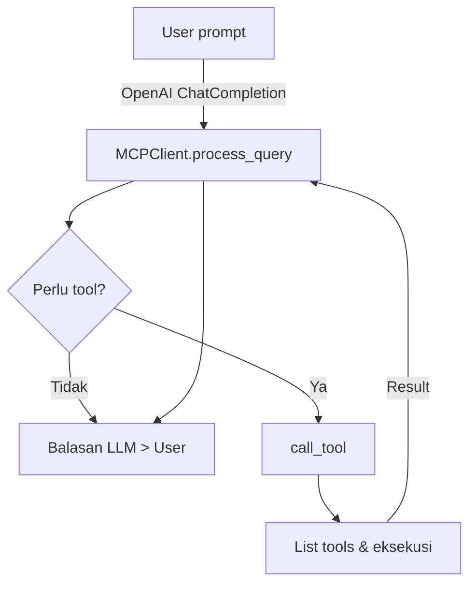

# ProjectWise Client

**ProjectWise Client** adalah library **Python asinkron** untuk terhubung ke **MCP (Server-Side “Model Context Protocol”)** via transport **SSE** _atau_ **STDIN/STDOUT**.
Client ini menangani discovery & eksekusi _tool_ (function calling) yang dipublikasikan server, serta mengorkestrasi percakapan LLM (OpenAI) agar model dapat memutuskan kapan memanggil tool dan kapan cukup menjawab langsung.&#x20;

---

## Fitur Utama

| Fitur                   | Ringkasan                                                                                |
| ----------------------- | ---------------------------------------------------------------------------------------- |
| **Dual transport**      | `connect()` otomatis memilih SSE (`http://host:port/sse`) atau proses lokal lewat STDIO. |
| **Auto tool discovery** | Memanggil `list_tools()` dan menyimpan skema setiap tool untuk OpenAI function-calling.  |
| **Query orchestration** | `process_query()` ⇒ prompt user ➜ LLM ➜ (opsional) tool-call ➜ LLM final.                |
| **CLI interaktif**      | `cli_chat.py` menyediakan REPL terminal siap pakai.                                      |
| **Logging terpusat**    | Log ditulis ke `logs/` secara otomatis, level default INFO di console & DEBUG ke file.   |

---

## Persyaratan

- **Python ≥ 3.13** (tertera di `pyproject.toml`)&#x20;
- Kunci OpenAI & `.env` (lihat contoh di `.env_example`).

---

## Instalasi

```bash
# Klon repositori
git clone https://github.com/username/projectwise-client.git
cd projectwise-client

# Siapkan virtual env
uv venv && source .venv/bin/activate   # Windows: .venv\Scripts\activate

# Pasang dependensi
pip install -e .         # memakai pyproject.toml
```

> **Tip** Jika Anda hanya ingin paket pip tanpa kloning repo:
> `pip install projectwise_client`

---

## Konfigurasi .env

Salin `.env_example` lalu ubah sesuai lingkungan Anda:

```dotenv
OPENAI_API_KEY=sk-...
MCP_SERVER_URL=http://localhost:5000/sse
LLM_MODEL=gpt-4o                # optional override
```

Semua variabel dibaca di kelas `Settings`&#x20;

---

## Penggunaan Cepat (Library)

```python
import asyncio
from mcp_client.client import MCPClient

async def main():
    client = MCPClient(model="gpt-4o")

    if not await client.connect():
        raise SystemExit("Tidak bisa konek ke MCP Server")

    jawab = await client.process_query(
        "Buat ringkasan risiko proyek dari KAK/TOR terbaru."
    )
    print(jawab)
    await client.cleanup()

asyncio.run(main())
```

---

## CLI Interaktif

```bash
python frontend/cli_chat.py
```

1. Masukkan URL MCP Server (atau Enter untuk `http://localhost:5000/sse`).
2. Ketik pertanyaan Anda.
3. `:quit` / `Ctrl-C` untuk keluar.

---

## Struktur Direktori

```
projectwise-client/
├─ mcp_client/
│  ├─ client.py        # implementasi MCPClient
│  ├─ settings.py      # baca .env & default
│  ├─ utils/logger.py  # konfigurasi logging
│  └─ …
├─ frontend/
│  ├─ cli_chat.py
└─ pyproject.toml
```

---

## Contoh Alur



---

## Lisensi

Released under the **MIT License** – lihat `LICENSE` untuk detail.

---

## Kontribusi

1. Fork & buat branch fitur.
2. Tambah unit-test di `tests/` (gunakan `pytest`).
3. Jalankan `pre-commit` sebelum push.
4. Buat Pull Request dengan deskripsi jelas.

Please collab !
